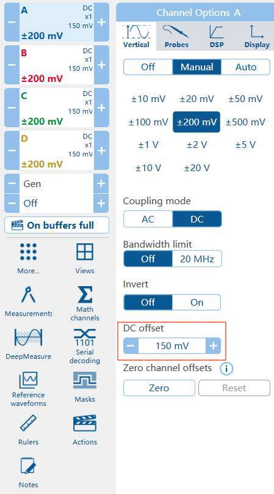

# CSV2ROOT package
This is a `C++ & shell script` program that automatically convert CSV file from picoscope output to CERN root file.
Supported system: Linux & MacOS\
Author: Meng Lyu (Shanghai Jiao Tong University)\
Date: 2023/12/28

## Installation
Make sure you can use ROOT before installation

```
git clone https://github.com/TwinklyStar/picoCSV2root.git
cd CSV2root
make
```
If there is no error, an executable file `CSV2root` should appear.

## Demo
### Convert CSV to ROOT
```
./run.sh
```
It will first rename directories and files inside, e.g. `20231228 (2)`->`20231228_2` and `20231228 (2)_01.csv`->`20231228_01.csv` for subsequent processing. This process is normally time consuming and
may account for more than half of the total running time.

After running, check `demo/RootData`, 9 root files are generated. Each one corresponds to a directory in `demo` that contains 10 waveforms.
This number can be set in picoscope GUI (recommended value: 10000).

If you want to automatically remove CSV file after converting, uncomment the last two lines in `run.sh`

### Merge root
Merge 9 root files into a single one:
```
./merge_root.sh
```
Check `demo/RootData` again, 9 root files are merged. The merged one has 90 entries in the tree `wfm`.

### Visualize first 10 waveforms (analysis example)
Go to `ana` directory
```
cd ana
./run_drawWaveform.sh
```
Check `plots` folder, the first 10 waveforms should be saved


## Convert your own file
You just need to change a few things before applying it to your own data:
1. `DATA_PATH` in `run.sh` and `merge_root.sh`\
The new `DATA_PATH` **MUST** have the same structure as `demo` and their name **MUST be YYYYMMDD in 8 digits**, which should be noted when saving the data in picoscope GUI:  
<div align=center></div>

2. `EXE_PATH` in `run.sh`  
You should change it to the FULL PATH where the executable `CSV2root` locates, so that you can execute `run.sh` somewhere else.
3. `offset` and `fpath` in `ana/drawWaveform.cpp`  
`offset` is the <font color=blue>DC offset</font> in the picoscope GUI for a larger dynamic range.  
For example, if your signal range is around [-300, 0] mV, instead of choosing $\pm500$mV, we should use $\pm200$mV with DC offset=150mV for high resolution, as the figure shows.  
When processing these data, we should subtract the DC offset first.  
<div align=center></div>