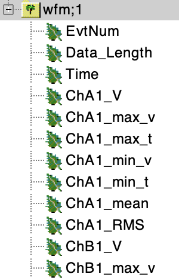

# CSV2ROOT package

This is a `C++ & shell script` program that automatically convert CSV file from picoscope output to CERN root file.
Supported system: Linux & MacOS  
Author: Meng Lyu (Shanghai Jiao Tong University)\
Date: 2024/01/28

## Description
This program supports automatic channel number detection.
The output file format is the same as the output from [DRS4bin2ROOT package](https://github.com/TwinklyStar/DRS4bin2root)
so that data from two digitizers can share the same analysis program (as provided in demo).  
At present, the program only supports processing from 1 picoScope. (DRS4 ver. supports up to 2 DRS4 mode in 
daisy-chain mode)

## Installation
Make sure you can use ROOT and `rename` command before installation

```
git clone https://github.com/TwinklyStar/picoCSV2root.git
cd CSV2root
chmod u+x run.sh merge_root.sh rm_csv.sh
make
```
If there is no error, an executable file `CSV2root` should appear.

## Demo
### Convert CSV to ROOT
```
./run.sh
```

It will first rename directories inside, e.g. `20231228 (2)`->`20231228_2` for subsequent processing.

After running, check `demo/RootData`, 9 root files are generated. Each one corresponds to a directory in `demo` that contains 10 waveforms.
This number can be set in picoscope GUI (recommended value: 10000).

If you want to automatically remove CSV file after converting, change `DATA_PATH` in `rm_csv.sh` and execute it. 

### Merge root
Merge 9 root files into a single one:
```
./merge_root.sh
```
Check `demo/RootData` again, 9 root files are merged. The merged one has 90 entries in the tree `wfm`.

### Visualize first 10 waveforms (analysis example)
Go to `ana` directory
```
cd ana
./run_drawWaveform.sh
```
Check `plots` folder, the first 10 waveforms should be saved

## Acquire your data
1. Set maximum waveforms, after which the "on buffer full" event will be triggered:  
<div align=center></div>  

2. Set continuous DAQ:
<div align=center></div>  

3. Set output file:
<div align=center></div>  
<div align=center></div>  

4. **It is strongly recommended to save a `.pssettings` file for every different DAQ setting**, since it contains the original setting when acquiring the data, including
   offset, delay and the unit of time and voltage (which is not included in the output data). Also, it'll be quite convenient to go back to the original setting by
   simply opening the `.pssettings` file in PicoScope software.
<div align=center></div>  

## Convert your data
You just need to change a few things before applying it to your own data:
1. `DATA_PATH` in `run.sh` and `merge_root.sh`\
The new `DATA_PATH` **MUST** have the same structure as `demo` and their name **MUST be YYYYMMDD in 8 digits**, which should be noted when saving the data in picoscope GUI.  
In addition, files with suffix `.log` and `.pssettings` will not be recognized as data. You can put these two kinds of files
in the folder as a recorder of the DAQ information and logs.  
<div align=center></div>


3. `EXE_PATH` in `run.sh`  
You should change it to the FULL PATH where the executable `CSV2root` locates, so that you can execute `run.sh` somewhere else.
4. `offset` and `fpath` in `ana/drawWaveform.cpp`  
`offset` is the <font color=blue>DC offset</font> in the picoscope GUI for a larger dynamic range.  
For example, if your signal range is around [-300, 0] mV, instead of choosing $\pm500$mV, we should use $\pm200$mV with DC offset=150mV for high resolution, as the figure shows.  
When processing these data, we should subtract the DC offset first.  
<div align=center></div>

## Analysis
### Visualize first 10 waveforms (analysis example)
Go to `ana` directory
```
cd ana/drawWaveform
./run_drawWaveform.sh
```
Check `plots` folder, the first 10 waveforms of demo should be saved  
Please change the offset and channel number to fit with your data

### Simple analysis example
Go to `ana` folder and find the `simpAna.cpp`. You can develop you own analysis code based on this example.  
To run demo:
```
root -l -q simpAna.C
```
To use it to your own data:
```
root -l -q 'simpAna.C("/path/to/your/data")'
```

### ChannelReader Class
The demo analysis program utilizes the `ChannelReader` class to read data from pico and DRS4 and read in the channel data
as class members, which can largely simplify the analysis program. You can also include it for your own analysis program.  
When creating an instance of this class, you should give a channel name as input parameter:
```
ChannelReader myReader("ChA1");     // this reader will read data from ChA1
```
The constructor will automatically execute `SetBranchAddress` according to its channel name.  
For a closed channel or invalid channel name, you can still create a reader for it,
but `myReader.GetStatus()` will return false.

The class has following members and function:
```
 std::vector<Double_t> *T;    // Pointer to the time vector
 std::vector<Double_t> *V;    // Pointer to the voltage vector
 Double_t max_v;
 Double_t max_t;
 Double_t min_v;
 Double_t min_t;
 Double_t mean;
 Double_t RMS;
 
 bool GetStatus()             // Returns true if channel is open
 TString GetName()            // Returns channel name, e.g., ChA1 
```

### File structure
The output root file structure in tree `wfm` is as follows:
<div align=center></div>
Unlike DRS4, the file does not contain capture time of each waveform, and 
all channels share the same time series. But the rest are the same:

```
EvtNum: UInt_t  // Original event number of each waveform (not the event number in TTree)
                // Because during CSV conversion, some events will be discarded due to overflow
                
Data_Length: Int_t  // Number of data point (fixed 1024 for DRS4, flexibale for picoScope)

Time: *std::vector<Double_t>  // Time (ns for DRS4, ns-ms for picoScope)
ChA(/B/C/D)1(/2)_V: *std::vector<Double_t>  // Voltage (mV for DRS4, mV-V for picoScope)
// Due to flexible unit and offset in picoScope, again, please save a .pssetting file for each DAQ setting

ChA(/B/C/D)1(/2)_max_v: Double_t  // Maximum voltage
ChA(/B/C/D)1(/2)_max_t: Double_t  // Time where the maximum voltage locates
ChA(/B/C/D)1(/2)_min_v: Double_t  // You know what it means
ChA(/B/C/D)1(/2)_min_t: Double_t  // You know what it means
ChA(/B/C/D)1(/2)_mean:  Double_t  // mean of the voltage vector
ChA(/B/C/D)1(/2)_RMS:   Double_t  // RMS of the voltage vector
```

